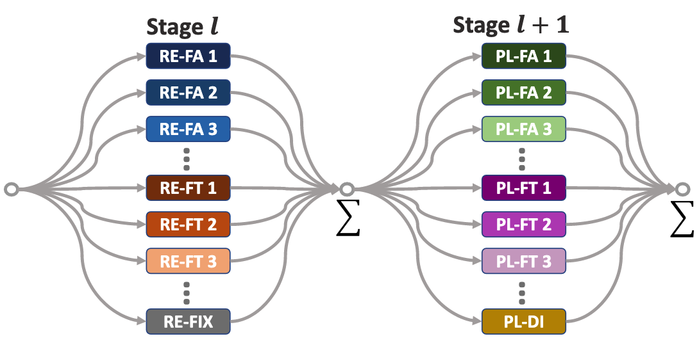

## About Me

I am a an Associate professor in SEU.

## Research Interests
I have wide interests in computer vision and machine learning. Some specific topics that I have previously worked on are listed below:
- **Computer Vision:** image recognition, image segmentation, object detection, point cloud
- **Machine Learning:** few-shot learning, meta-learning, incremental learning, long-tailed recognition, open-set recognition, AutoML, knowledge distillation

## Extracurricular Activities
Besides research, I also actively participate in many extracurricular activities. I was in Top 8 of Good Voice of Universities 2015 in CUMT. I play football regularly and keep a record of  Dribbling & Shooting  in CUMT. I am a fan of  <del>Football Club of Barcelona</del> PSG. My favourite singers are Jacky Cheung and Freddie Mercury.

## News

## Selected Publications
[comment]: <> (iccv2021.)

  

<strong>Meta Navigator: Search for a Good Adaptation Policy for Few-shot Learning</strong>
 
<strong>Chi Zhang</strong>, Henghui Ding, Guosheng Lin, Ruibo Li, Changhu Wang, Chunhua Shen
 
<em>IEEE International Conference on Computer Vision. <strong><i style="color:#1e90ff">ICCV 2021</i></strong>.</em>
  
   [<a href="https://openaccess.thecvf.com/content/ICCV2021/papers/Zhang_Meta_Navigator_Search_for_a_Good_Adaptation_Policy_for_Few-Shot_ICCV_2021_paper.pdf">PDF</a>]
 

<!---

comment

-->
 
 
 

